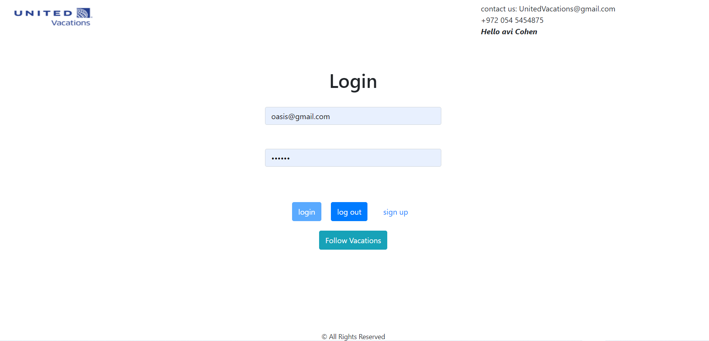
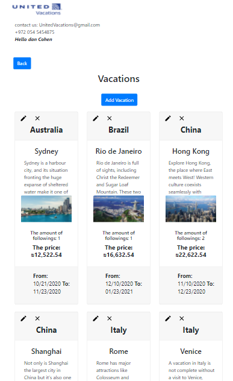
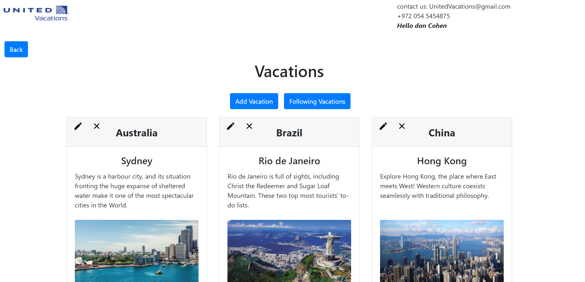
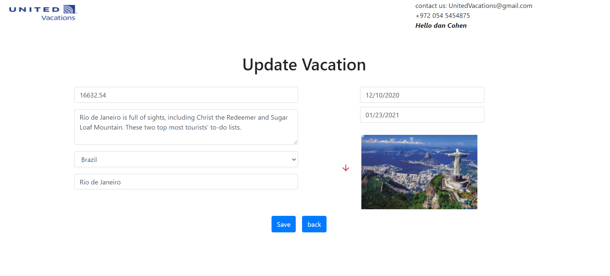
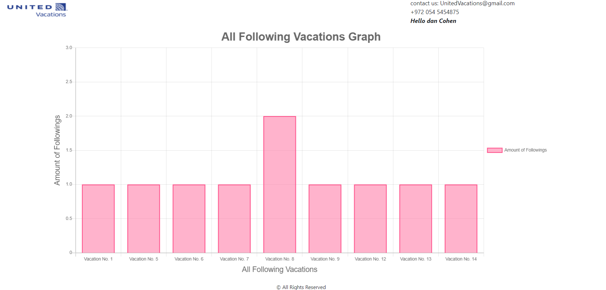

# Vacations Site

Vacation Follow-Up system  

## Topics:

* HTML + CSS
  - HTML5 Structure
  - Bootstrap design
* React
  - Redux
  - React -saga / thunk / middleware
  - Container components / service component / router etc..
* NodeJS
  - Using express
  - Restfull App
* MySQL
  - Design & create schema
  - Queries

***

### Main Page:

***

### Mobile Friendly:

***

### Admin Mode:
* You can edit, add, delete a product.

***

### Edit Panel:

* There's also an option to add a vacation

***

### Admin Bar Graph:
* Shows all following vacations and their amount of followings

***
